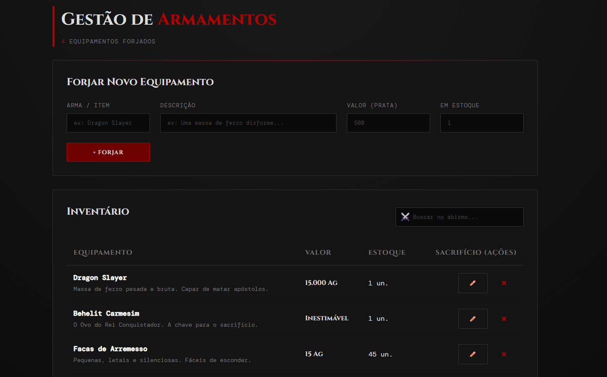

# ⚔️ Arsenal de Berserk (CLYVO VET)

API REST épica desenvolvida com Java + Spring Boot para gerenciamento de armamentos (entidades), utilizando Oracle Database como banco de dados e Docker para containerização da aplicação.

A aplicação possui:
- CRUD completo de equipamentos (Pets)
- Interface visual sombria inspirada em Berserk
- Persistência de dados inabalável com Oracle XE 21c
- Deploy em máquina virtual Azure utilizando Docker Compose

---

# ☁️ Infraestrutura Cloud (Azure)

A forja do ferreiro Godot está hospedada em uma máquina virtual Ubuntu na Microsoft Azure.

## 📌 Informações da VM

| Configuração | Valor |
|---|---|
| Resource Group | `rg-challenge-clyvo-vet` |
| Região | `brazilsouth` |
| VM | `vm-wise-clyvo-dev-01` |
| Sistema Operacional | Ubuntu 22.04 |
| Tamanho | `Standard_B4ls_v2` |
| IP Público | `20.201.77.100` |

---

# 🐳 Containers Docker

A infraestrutura utiliza Docker Compose com dois containers em rede isolada:

| Container | Descrição |
|---|---|
| `portalweb` | Aplicação Spring Boot (Sem privilégios de root) |
| `oracle-db` | Banco de dados Oracle XE 21 (Com volume nomeado) |

---

# 🌐 Endpoints da API

| Método | Endpoint | Descrição |
|---|---|---|
| `GET` | `/api/pets` | Inspeciona todos os equipamentos |
| `POST` | `/api/pets` | Forja um novo equipamento |
| `PUT` | `/api/pets/{id}` | Reforja um equipamento existente |
| `DELETE` | `/api/pets/{id}` | Consome um equipamento pelo ID (Sacrifício) |

---

# 🖥️ Interface Web

A aplicação possui um frontend interativo imersivo para o gerenciamento do inventário do arsenal.



## Funcionalidades

- Forja (Cadastro) de novos itens
- Inventário (Tabela) em tempo real
- Rastreio (Busca) dinâmico
- Reforja (Edição) de atributos
- Sacrifício (Exclusão) definitiva

---

# 🗄️ Banco de Dados

Banco utilizado:

- Oracle Database XE 21 Slim

## Configurações da aplicação

Arquivo:

```bash
src/main/resources/application.properties

🚀 Executando o Projeto
Pré-requisitos
Docker

Docker Compose

Executar localmente
Na raiz do projeto execute:

Bash
docker compose up --build -d
Acessar aplicação
Interface Web
Bash
[http://20.201.77.100:8080](http://20.201.77.100:8080)
API REST
Bash
[http://20.201.77.100:8080/api/pets](http://20.201.77.100:8080/api/pets)
🐳 Docker Hub
Imagem publicada no Docker Hub:

Bash
maicon/challenge-clyvo-vet:v1.0
📦 Estrutura do Projeto
Bash
clyvovet/
│
├── src/
├── Dockerfile
├── docker-compose.yml
├── setup-azure.sh
├── pom.xml
├── README.md
└── assets/
    └── interface.png
🛠️ Tecnologias Utilizadas
Java 17

Spring Boot 3

Spring Data JPA

Oracle Database 21c

Docker

Docker Compose

Microsoft Azure

Maven

👨‍💻 Desenvolvedor
Nome: Maicon Douglas

RM: 561279

Turma: 2TDSPW